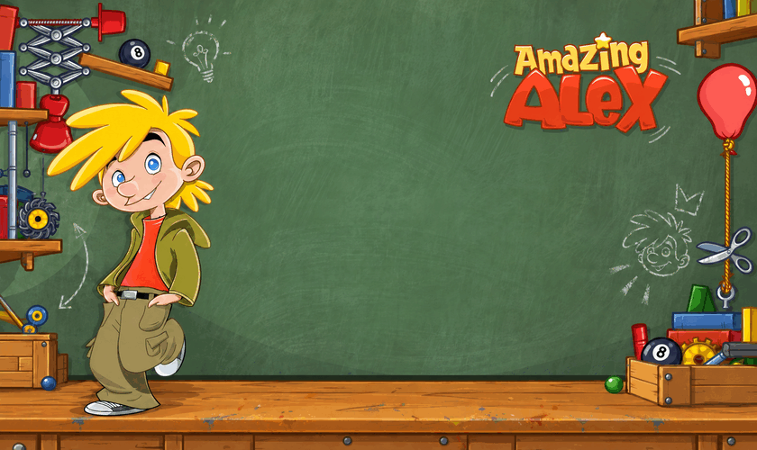

# Amazing Alex HD for PlayStation Vita

This is a **heavily AI-assisted** port of the Android version of Amazing Alex
HD **1.0.5** to PlayStation Vita. The loader runs the original ARMv7 game engine
using vitaGL, so_util and a small Java compatibility layer.



You will need your own **Amazing Alex HD 1.0.5 Android APK**. The APK, original
native game library, levels, gameplay graphics and music are excluded from
this repository and the VPK. Launcher artwork is included. The trial version
and other releases are not supported by the data preparation script.

## First installation

The Vita needs homebrew support, VitaShell, the kubridge kernel plugin and
`ur0:data/libshacccg.suprx`. The data preparation script requires Python 3.9+
on your PC and uses only the standard library.

1. Download or clone this repository and open a terminal in its folder.
2. Run `python scripts/prepare_data.py "/path/to/AmazingAlexHD-1.0.5.apk"`.
3. Copy `dist/data/amazingalex/` to `ux0:data/amazingalex/` on the Vita. The
   result must contain `ux0:data/amazingalex/libamazingalex.so` and
   `ux0:data/amazingalex/assets/`.
4. Copy [Amazing-Alex-Vita-v0.4.vpk](releases/Amazing-Alex-Vita-v0.4.vpk) to the
   Vita and install it with VitaShell.
5. Open the **Amazing Alex HD** bubble. Its title ID is **ALEX00001**.

Alternatively, keep VitaShell's FTP screen open and run
`python scripts/stage.py --host VITA_IP`. It transfers over port **1337**;
keep VitaShell open for the entire transfer. This stages the VPK at
`ux0:/Amazing Alex HD.vpk` and uploads the data. Installation is still done in
VitaShell. The script verifies the VPK and game library by reading them back,
and verifies the size of each uploaded asset.
It uses your local build if present, otherwise the included build 0.4 VPK.
Use `--vpk PATH` to select a different installer.

Data preparation checks the native library on the PC and expands the nested
texture ZIPs there. The loader performs quick file checks when launched,
without hashing or extracting the entire package on the Vita.

## Controls and implementation

- Native ARMv7 engine, Box2D physics and renderer run through the loader.
- Front touchscreen events feed the original touch interface. Start and Circle
  map to Android Back. Gameplay uses the touchscreen; sticks are not mapped.
- The game's MP3 decoder and mixer feed a Vita audio thread, with conversion
  to 48 kHz stereo output. Two aligned output buffers keep queued samples
  intact while the next chunk is mixed.
- HTTP requests take the game's normal failure callback and cleanup path.
  Socket and DNS entrypoints fail locally, analytics calls do nothing, and
  embedded browser support is reported unavailable.
- Saves use `ux0:data/amazingalex/saves/`.
- Development diagnostics go to `ux0:data/amazingalex/loader.log`. Frequent
  traces are disabled by default and the log is bounded.


## Build and checks

Build on Linux or WSL with the SoftFP VitaSDK. You also need CMake, make,
patch, a host C compiler and the usual Unix utilities. Dependencies are
vendored in `lib/`, so a recursive submodule checkout is unnecessary.

```sh
export ALEX_VITASDK=/path/to/softfp-vitasdk
bash scripts/build.sh
bash scripts/test-jni.sh
bash scripts/test-audio.sh
```

`bash scripts/setup-sdk.sh` can install the pinned toolchain and the SoftFP
package dependencies (downloaded from their rolling `master` release). The
default SDK path reuses the existing Scribblenauts SoftFP SDK; the build output
uses a separate `~/.cache/amazing-alex-vita/build-project/` directory.
The VPK is written to `build/amazing_alex_vita.vpk`.
Set `ALEX_DIAGNOSTICS=OFF` for a build without development logging. The included
build 0.4 keeps bounded diagnostics enabled.

The JNI host check uses AddressSanitizer and UndefinedBehaviorSanitizer to
exercise object lifetimes, UTF-8 strings, arrays, audio constructor arguments,
asset reads and offline availability results. It tests variadic/V calls used
by this game; it does not validate ARM machine-code execution or legacy JNI
array-argument adapters.

The audio host check retains queued buffers to detect premature overwrites,
and checks alignment, stereo continuity across native refills, unsigned PCM
silence and shutdown under AddressSanitizer and UndefinedBehaviorSanitizer.
Build 0.4 also passed the user's listening test in the menu and during a level.

Once the bubble is installed, `python scripts/vita.py deploy --host VITA_IP`
updates its executable and launches it. `logs`, `launch` and `stop` are also
available. The installed Companion service uses ports 1337 and 1338, with
plain-text `destroy` and `launch ALEX00001` commands. `destroy` closes running
applications for the development session.
Do not run `stop` or `deploy` during a VitaShell transfer: the `destroy`
command also closes VitaShell and interrupts its FTP server.


## Credits

Amazing Alex and its original game assets belong to Rovio and their respective
owners. This is an unofficial community port.
The port reuses compatibility work from the Scribblenauts Remix Vita project
and the soloader boilerplate by Volodymyr Atamanenko and contributors, including
work by Andy Nguyen, Rinnegatamante and Ellie J Turner. Third-party source and
license notices are retained under `lib/` and in the copied compatibility
files. See [THIRD_PARTY.md](THIRD_PARTY.md), `LICENSE` and each dependency's
license for their applicable terms. The source-code licenses do not grant
rights to the original game or its artwork.
